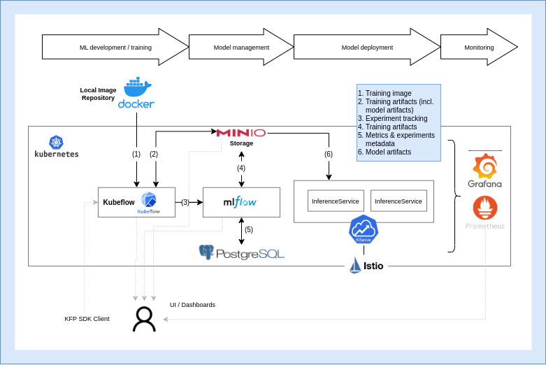

# Silo AI MLOps Platform

Welcome to the Silo AI MLOps Platform, a comprehensive suite designed to streamline your machine learning operations from experimentation to deployment.

 


## Overview of Project Structure

- **Setup Scripts**
  - [`setup.sh`](setup.sh): The primary script to install and configure the platform on your local machine.
  - [`setup.md`](setup.md): Detailed documentation for platform setup and testing procedures.

- **Deployment Resources**
  - [`deployment/`](deployment): Contains Kubernetes deployment manifests and configurations for Infrastructure as Code (IaC) practices.

- **Tutorials and Guides**
  - [`tutorials/`](tutorials): A collection of resources to help you understand and utilize the platform effectively.
    - [`local_deployment/`](tutorials/local_deployment): A comprehensive guide for local deployment, including configuration and testing instructions.
    - [`demo_notebooks/`](tutorials/demo_notebooks): A set of Jupyter notebooks showcasing example ML pipelines.

- **Testing Suite**
  - [`tests/`](tests): A suite of tests designed to ensure the platform's integrity post-deployment.

## Special Instructions for Mac Users

> **Important Notice for Mac Users:** Ensure Docker Desktop is installed on your machine, not Rancher Desktop, to avoid conflicts during the `kubectl` installation process.

If Rancher Desktop was previously installed, please uninstall it and switch to Docker Desktop. Update your Docker context with the following command:

```bash
docker context use default
```

Additionally, confirm that Xcode is installed correctly to prevent potential issues:

```bash
xcode-select --install
```

## Getting Started with a local setup

To set up the platform locally, execute the [`setup.sh`](setup.sh) script. For a concise setup overview, refer to the [setup guide](setup.md), or for a more detailed approach, consult the [manual setup instructions](tutorials/local_deployment).

## Exploring Demo Examples

Dive into our demo examples to see the platform in action:

> TODO

[//]: # (- **Jupyter Notebooks**:)

[//]: # (  - Explore ML pipelines related to wine quality analysis.)

[//]: # (  - Investigate fairness and energy monitoring in ML pipelines.)

[//]: # (  - [Demo Notebooks]&#40;tutorials/demo_notebooks&#41;)

[//]: # ()
[//]: # (- **Project Use-Case**:)

[//]: # (  - Examine the RD/IML4E Siemens use-case featuring TTPLA/YOLACT.)

[//]: # (  - [Siemens Use-Case Project]&#40;https://bitbucket.org/siloai/rd-iml4e-ttpla-siemens-usecase/src/master/&#41;)

[//]: # ()
[//]: # (- **Interactive Tutorials**:)

[//]: # (  - Get hands-on with MLflow, Kubeflow Pipelines, and KServe through these interactive resources:)

[//]: # (    - [Try out MLflow]&#40;tutorials/resources/try-mlflow&#41;)

[//]: # (    - [Try out Kubeflow Pipelines]&#40;tutorials/resources/try-kubeflow-pipelines&#41;)

[//]: # (    - [Try out Kserve]&#40;tutorials/resources/try-kserve&#41;)

## High-Level Architecture Overview

The following diagram illustrates the architectural design of the MLOps platform:



### Key Components

- **Kind**: Simplifies local Kubernetes cluster setup.
- **Kubernetes**: The backbone container orchestrator.
- **MLFlow**: Manages experiment tracking and model registry.
  - **PostgreSQL DB**: Stores metadata for parameters and metrics.
  - **MinIO**: An artifact store for ML models.
- **Kubeflow**: Orchestrates ML workflows.
- **KServe**: Facilitates model deployment and serving.
- **Prometheus & Grafana**: Provides monitoring solutions with advanced visualization capabilities.

---

By following this guide, you'll be well on your way to leveraging the full potential of the Silo AI MLOps Platform for your machine learning workflows.