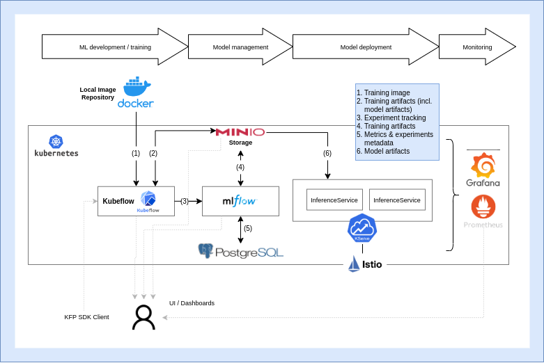
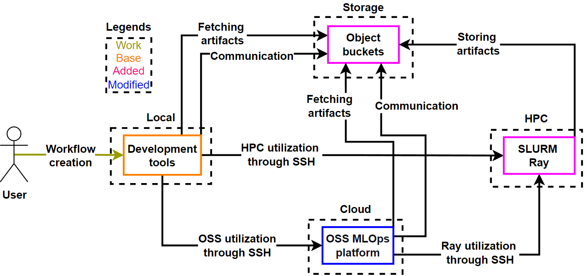

# OSS MLOps Platform

Welcome to the OSS MLOps Platform, a comprehensive suite designed to streamline your machine learning operations from experimentation to deployment.


## Overview of Project Structure

- **Setup Scripts**
  - [`setup.sh`](setup.sh): The primary script to install and configure the platform on your local machine.
  - [`setup.md`](setup.md): Detailed documentation for platform setup and testing procedures.
  - [`integration-setup.sh`](integration-setup.sh): The secondary script to install and configure the integrated platform on your cloud machine.
  - [`integration-setup.md`](/applications/integration/documentation/integration-setup.md): Detailed documentation for integrated platform setup.

- **Deployment Resources**
  - [`deployment/`](deployment): Contains Kubernetes deployment manifests and configurations for Infrastructure as Code (IaC) practices.

- **Tutorials and Guides**
  - [`tutorials/`](tutorials): A collection of resources to help you understand and utilize the platform effectively.
    - [`local_deployment/`](tutorials/local_deployment): A comprehensive guide for local deployment, including configuration and testing instructions.
    - [`gcp_quickstart/`](tutorials/gcp_quickstart): A guide for a quickstart deployment of the platform to GCP.
    - [`gcp_deployment/`](tutorials/gcp_deployment): A guide for a production-ready deployment of the platform to GCP.
    - [`demo_notebooks/`](tutorials/demo_notebooks): A set of Jupyter notebooks showcasing example ML pipelines.
    - [`ray/`](tutorials/ray): A guide for setting up and using [Ray](https://docs.ray.io/en/latest/index.html).

- **Testing Suite**
  - [`tests/`](tests): A suite of tests designed to ensure the platform's integrity post-deployment.

## What are MLOps platforms

Machine learning operations (MLOps) is a intersection paradigm that uses principles to create machine learning products:


MLOps platforms provide a unified user interface for developing ML workflows and products:


Thus, MLOps platforms such as OSS provide a MLOps system that enable developers to focus on improving their products such as models. 

## Special Instructions for Mac Users

> **Important Notice for Mac Users:** Ensure Docker Desktop is installed on your machine, not Rancher Desktop, to avoid conflicts during the `kubectl` installation process.
If Rancher Desktop was previously installed, please uninstall it and switch to Docker Desktop. Update your Docker context with the following command:

```bash
docker context use default
```

Additionally, confirm that Xcode is installed correctly to prevent potential issues:

```bash
xcode-select --install
```

## Getting Started with a local setup

To set up the platform locally, execute the [`setup.sh`](setup.sh) script. For a concise setup overview, refer to the [setup guide](setup.md), or for a more detailed approach, consult the [manual setup instructions](tutorials/local_deployment).

## Exploring Demo Examples

Dive into our demo examples to see the platform in action:

- **Jupyter Notebooks (e2e)**:

  - [Demo Wine quality ML pipeline.](tutorials/demo_notebooks/demo_pipeline)

  - [Demo Fairness and energy monitoring pipeline.](tutorials/demo_notebooks/demo_fairness_and_energy_monitoring)
  
  - [Demo Ray-Kubeflow pipeline.](tutorials/ray/notebooks/ray_kubeflow.ipynb)

- **Project Use-Cases (e2e)**:

  - [Fashion-MNIST MLOPS pipeline](https://github.com/OSS-MLOPS-PLATFORM/demo-fmnist-mlops-pipeline)

## High-Level Architecture Overview

The following diagram illustrates the architectural design of the MLOps platform:



### Key Components

- **Kind**: Simplifies local Kubernetes cluster setup.
- **Kubernetes**: The backbone container orchestrator.
- **MLFlow**: Manages experiment tracking and model registry.
  - **PostgreSQL DB**: Stores metadata for parameters and metrics.
  - **MinIO**: An artifact store for ML models.
- **Kubeflow**: Orchestrates ML workflows.
- **KServe**: Facilitates model deployment and serving.
- **Prometheus & Grafana**: Provides monitoring solutions with advanced visualization capabilities.

## Getting Started with a integrated setup

To set up the integrated platform to cloud, you first need to have a CSC account and projects with access to the following services:

- [CPouta](https://docs.csc.fi/cloud/pouta/): Infrastructure as a service cloud platfrom
- [Allas](https://docs.csc.fi/data/Allas/): S3-based object storage platform
- [Puhti](https://docs.csc.fi/computing/systems-puhti/): SLURM-based HPC platform offering:
  - Petaflops: 1.8 CPU and 2.7 GPU
  - Nodes: 682 CPU and 80 GPU
  - Max nodes: 26 CPU and 20 GPU
  - Max time: 14 days for CPU and 3 days for GPU 
- [Mahti](https://docs.csc.fi/computing/systems-mahti/): SLURM-based HPC platform offering:
  - Petaflops: 7.5 CPU and 2.0 GPU
  - Nodes: 1404 CPU and 24 GPU
  - Max nodes: 700 CPU and 6 GPU
  - Max time: 7 days for CPU and 36 hours for GPU 
- [LUMI](https://docs.lumi-supercomputer.eu/hardware/): SLURM-based HPC platform offering:
  - Petaflops: 10.3 CPU and 379.70 GPU
  - Nodes: 2048 CPU and 2978 GPU
  - Max nodes: 512 CPU and 1024 GPU
  - Max time: 2 days for CPU and 2 days for GPU 

To integrate these into the OSS MLOps platform, see detailed setup [guide](/applications/integration/documentation/integration-setup.md).

## Exploring integration examples

Dive into our demo examples to see the integrated platform in action:

- **Jupyter Notebooks (e2e)**:
  
  - [Demo Cloud-HPC Fashion-MNIST pipeline.](tutorials/demo_notebooks/demo_cloud_hpc_integration/demo_cloud_hpc_fmnist_pipeline.ipynb)

## High-Level Integration Overview

The following diagram illustrates the architectural design of the cloud-HPC integrated MLOps platform:



## Support & Feedback

Join our Slack [oss-mlops-platform](https://join.slack.com/t/oss-mlops-platform/shared_invite/zt-28m00bllw-0zl2cuKILh6oa2dIwDN_DQ)
workspace for issues, support requests or just discussing feedback.

Alternatively, feel free to use GitHub Issues for bugs, tasks or ideas to be discussed.

Contact people:

Harry Souris - harry.souris@silo.ai

Joaquin Rives - joaquin.rives@silo.ai