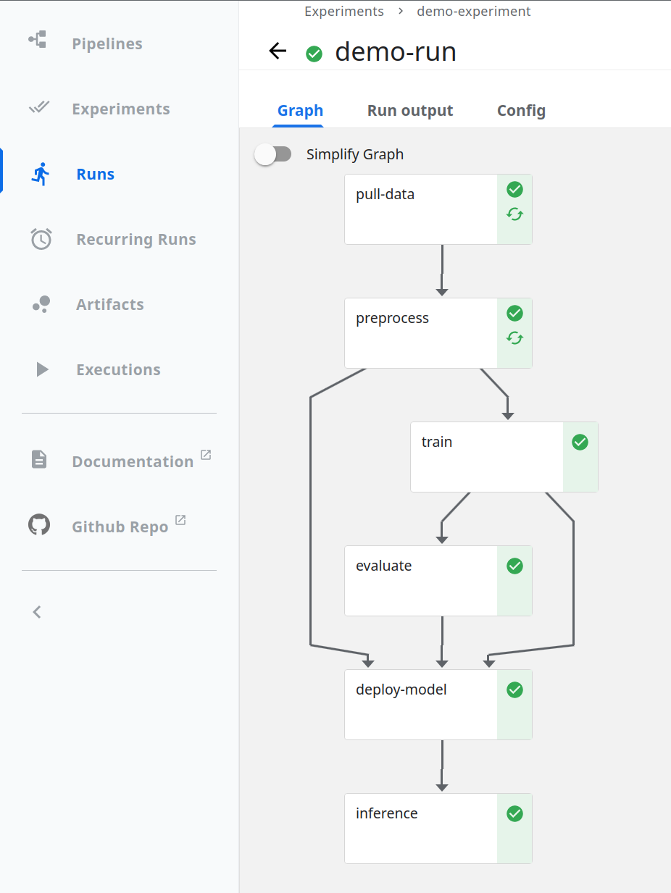

# Demo pipeline (standalone KFP)

Jupyter notebook with a demo pipeline that uses the installed standalone Kubeflow Pipelines (KFP), MLflow and Kserve components.

> **NOTE:** This demo is intended for the standalone-KFP + Kserve deployment option.

 

